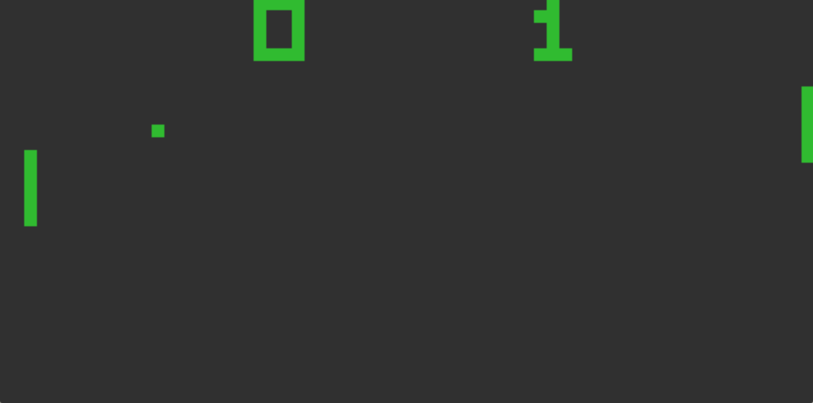

# chip8

An emulator for the CHIP-8 system, because every emulator developer should probably write one for fun.



# Building

[SDL2](https://libsdl.org/) is required for the graphics, and it can be installed via many different package managers:

```
$ brew install sdl2
$ sudo apt-get install libsdl2-dev
$ sudo yum install SDL2-devel
```

Or see the [libsdl installation documentation](https://wiki.libsdl.org/Installation) for more options.

After that, it can be built with `make`:

```
$ make all
```

# Running

ROMs can be sourced from anywhere you like, however I recommend getting them from [dmatlack/chip8](https://github.com/dmatlack/chip8/tree/master/roms/games). ROMs can be invoked with the path to the ROM as the argument:

```
$ ./chip8 roms/pong.ch8
```

# Keyboard

The original CHIP-8 keypad is on the left, and what I've mapped it to on a QWERTY keyboard is on the right:

```
Keypad                   Keyboard
+-+-+-+-+                +-+-+-+-+
|1|2|3|C|                |1|2|3|4|
+-+-+-+-+                +-+-+-+-+
|4|5|6|D|                |Q|W|E|R|
+-+-+-+-+       =>       +-+-+-+-+
|7|8|9|E|                |A|S|D|F|
+-+-+-+-+                +-+-+-+-+
|A|0|B|F|                |Z|X|C|V|
+-+-+-+-+                +-+-+-+-+
```

# Things To Do

1. Some games still have quirks. Some need to run at different clock rates, and some expect different behaviours. Probably not going to fix this.
